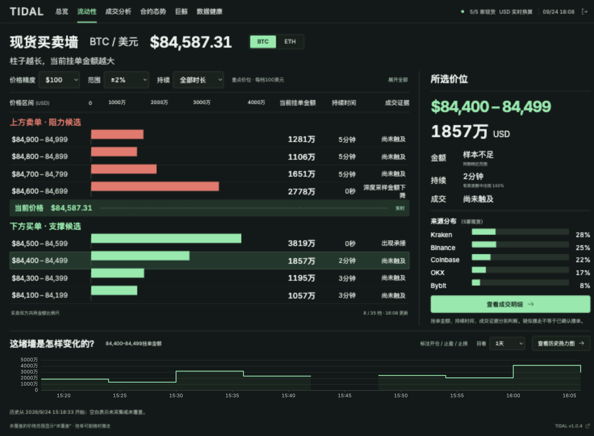

# TIDAL 潮汐 · 加密市场情报

面向中文用户的 BTC / ETH 现货买卖墙、实际成交、合约背景与公开巨鲸看板。默认用横向柱子表示价格区间内的美元挂单金额；买卖双方共用线性比例尺，热力图作为进阶历史视图。

首次使用请阅读 [看板使用说明](docs/USAGE.md)。



## 数据说明

- 五家现货：OKX、Binance、Coinbase、Kraken、Bybit，24 个 BTC / ETH 交易对。USD / USDT / USDC 按采样时 Kraken 美元汇率换算；过期汇率退出有效汇总。
- 支撑 / 阻力均为候选区域。金额、持续时间、出现比例和成交证据分别展示；同一价位长期有挂单不表示同一笔订单。断线、序列缺口、深度边界和汇率变化不据此判断撤单。
- 主动净买入 = 主动买入额 − 主动卖出额，是已观察成交的方向统计，不是交易所充值 / 提现。缺口会标记为部分统计；CVD 随所选窗口重新累计。
- OKX、Binance、Bybit USDT 永续提供单边 OI、实际结算周期的资金费率、基差、成交和已观察清算。Binance / OKX 清算发布存在抽样，不能视作完整市场清算总额。
- Hyperliquid 公开 BTC / ETH 原生永续地址榜只覆盖监控池。持仓均价不是第一笔开仓价，也不含完整费用；显示设置杠杆。清算价为空时保持为空，清算分布是当前条件下涉及的仓位金额，不是触价必然爆仓金额。
- 仅手工价格标注，不提交交易订单。

## 本地运行

需要 Go 1.25、Node.js 22。无需交易所 API 密钥。

```bash
npm --prefix web ci
npm --prefix web run build
go build -o bin/tidal ./cmd/tidal
# 将至少 12 位的独立访问密码放在 TIDAL_PASSWORD 环境变量中：
./bin/tidal hash-password > /absolute/path/password_hash
# password_hash 必须放在仓库外或已忽略的 secrets/ 内，权限设为 600。
TIDAL_PASSWORD_HASH_FILE=/absolute/path/password_hash TIDAL_COOKIE_SECURE=false ./bin/tidal
```

本地访问 `http://127.0.0.1:8080`。开发时运行 `npm --prefix web run dev`，Vite 代理到本地 Go API。仅开发模式支持 `?demo=1` 布局对照数据；生产构建移除演示分支。

## 验证

```bash
go test -race ./...
go vet ./...
npm --prefix web run typecheck
npm --prefix web run build
npm --prefix web test
bash -n deploy/*.sh
```

测试覆盖：报价与合约单位、主动方向、去重、序列缺口与恢复、官方 Kraken CRC 示例、OKX 深度去重、陈旧汇率、空清算价、核心地址上限、汇总语义、分区清理、认证、跨站请求与并发访问。

## 发布

本地提交 → GitHub 检查 → `main` → 发布正式 `vX.Y.Z` Release → GitHub Actions 构建 Linux amd64 镜像 → GHCR → 服务器按摘要部署。草稿、预发布和普通提交不更新生产。项目镜像包已公开；后续保持 GHCR 的 Public 可见性，部署会验证匿名拉取。

服务器部署入口只接受 `deploy sha256:<digest> <commit> vX.Y.Z`，核对公开正式 Release、提交与镜像来源。生产 SSH 私钥仅存在 GitHub Secrets 和受保护的本地配置中；不使用仓库内凭据。更新保留数据卷和上一镜像，健康失败回退。详见 [运维说明](docs/OPERATIONS.md)。

## 存储与资源

Go 采集 / API + React / TypeScript + 日期 / 精度分区 SQLite + Nginx / Docker Compose。目标为 2 CPU / 约 2GB 内存的小服务器。

| 数据 | 保留 |
| --- | --- |
| 原始增量、逐笔成交 | 有界内存，不长期落盘 |
| 5 秒聚合盘口 | 24 小时；按整日分区删除，最多多保留 1 天 |
| 1 分钟分来源盘口、成交、合约、巨鲸分布 | 30 天 |
| 5 分钟地址仓位快照 | 30 天 |
| 15 分钟汇总 | 30 / 90 天可选 |
| 日志、运维采样、元数据备份 | 最长 7 天，同时限制日志大小 |

项目预算 20GB，巨鲸历史子预算 2GB，磁盘至少留 8GB。五分钟检查容量；优先删旧细数据，无法释放时暂停细历史并维持实时和粗采样。清理按日分区；关闭页面不停止采集。

## API

除 `/healthz`、`/readyz`、登录与会话状态外均需会话 Cookie：

- `GET /api/v1/overview` / `levels` / `stream`：`asset`、`step`、`range`、`minAge`。
- `GET /api/v1/history`：`hours`、`price`、`step`，可选 `heatmap=1`。
- `GET /api/v1/candles`：`hours`、`period`（秒），综合现货报价 OHLC。
- `GET /api/v1/flow`：`market=spot|perp`、`hours`，成交足迹、VWAP、CVD、来源与缺口。
- `GET /api/v1/derivatives`：`hours`，OI / Funding / 基差与历史。
- `GET /api/v1/whales`：`limit=10|50`、`side=all|long|short`，地址明细及分布。
- `GET/POST /api/v1/watchlist`；`GET/PUT /api/v1/settings`；`GET /api/v1/health`。
- `GET/POST/DELETE /api/v1/annotations`；`POST /api/v1/logout`。

金额使用整数美分；价格、时间、汇率、覆盖和有效性随数据提供。原始盘口价格 / 数量在内存保留原字符串用于校验；前端展示为换算后的美元区间。

## 接口来源

[OKX](https://app.okx.com/docs-v5/en/) · [Binance](https://github.com/binance/binance-spot-api-docs) · [Coinbase](https://docs.cdp.coinbase.com/exchange/websocket-feed/channels) · [Kraken](https://docs.kraken.com/exchange/guides/websockets/book-checksum-v2) · [Bybit](https://bybit-exchange.github.io/docs/v5/websocket/public/full-ob) · [Hyperliquid](https://hyperliquid.gitbook.io/hyperliquid-docs/for-developers/api/info-endpoint/perpetuals)

验收状态见 [STATUS](docs/STATUS.md)。持续运行 72 小时的资源验收与短测分开记录。
